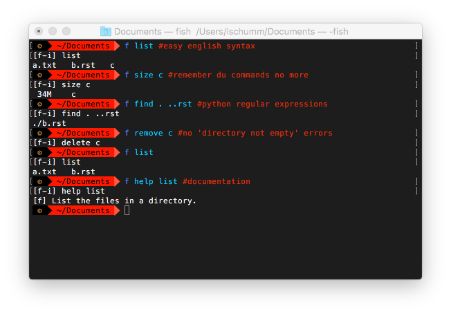

*****
fTerm
*****

-----

|homebrew| |gplv3| |code-climate| |ethical-design| |sloccount|

-----

=====
About
=====

fTerm is a terminal command parser with english syntax and natural language processing.

======
How-To
======

To run *command* with arguments *a1, a2,...*, simply run

.. code::

   f command a1, a2,...

The fTerm interpreter will then attempt to interpret *command*.
First it will check if it was defined as a synonym of another, defined, command, and then do a string-based (typo-preventing) search. It will then prompt you with

.. code::

   [f-i] interpreted_command a1, a2...

If you enter anything (except just pressing the return key), the command will not be run.

========
Examples
========

.. code::

   $ f list
   [f-i] list⏎
   a.txt
   b.rst
   c.mp4
   $ f remove b.rst
   [f-i] delete a⏎
   $ f list
   [f-i] list⏎
   a.txt
   c.mp4

.. code::

   $ f read a
   [f-i] read a⏎
   this is a test!
   $ f read b
   [f-i] read b⏎
   this is also a test!
   $ f swap a b
   [f-i] swap a b⏎
   [f] Swapped a and b
   $ cat a
   this is also a test!
   $ cat b
   this is a test!

.. code::
   
   $ f find .
   ./skynet.py
   ./lib/ai.py
   ./lib/ai.pyc
   ./lib/soul.py
   ./lib/soul.pyc
   $ f find . f find lib/ \(\.\*\)pyc\$
   ./lib/ai.py
   ./lib/soul.pyc

========
Commands
========

.. lib/directory.py
temp
----

Make a temporary file.

list *\*dirs*
-------------

List the files in a directory.

swap *file1* *file2*
--------------------

A function that swaps the names of two files.

delete *\*files*
----------------

Delete a file or directory.

move *path1* *path2*
--------------------

Move the file or folder at *path1* to *path2*.

copy *path1* *path2*
-------------------

Copy the file or folder at *path1* to *path2*.

sort *directory* *exp*
----------------------

Takes a directory *directory* and a regular expression *exp*. Sorts each file into a folder with name equal to the match of *exp* in its filename.

where
-----

(For shells that don't have a path string) show the current directory.

find *directory* *exp="[\s\S]\*"* *func=""*
-------------------------------------------

Find all files in *directory* that match (python) regular expression *exp*. If specified, runs *func* on these files.

.. lib/file.py
read *\*files*
--------------
Read a file.

edit *\*files*
--------------

Edit a file.
   
addline *filename* *line*
-------------------------

Append *line* to *filename*.

removeline *filename* *line*
----------------------------

Remove the line of number *line* (0-indexed) from file *filename*.

.. lib/misc.py
size *\*files*
--------------

Return the size of a file in human-readable format.

run *\*files*
-------------

A universal run function.

kill *\*processes*
------------------

Kill the process with name *processname*.

processes
---------

Alias for htop.

users
-----

Alias for w.

rtfm *\*manpages*
-----------------

Fun shortcut to man.

.. lib/zapcore.py
compress *\*files*
------------------

Compress a file.

decompress *\*files*
--------------------

Decompress a file.

decrypt *\*files*
-----------------

Decrypt a file.

encrypt *\*files*
-----------------

Encrypt a file.

pack *\*files*
--------------

Pack a file/folder into a tar archive (no compression).

unpack *\*files*
----------------

Unpack a tar archive into a file/folder.

.. load.py
commands
--------

List all fTerm commands, their argspecs, and their docstrings.

help *commandname*
------------------

Returns the docstring for fTerm command *commandname*.

fterm_version
-------------

Returns the current fTerm version.

****************
Installing (Mac)
****************

First, run

.. code::

   brew tap fterm/fterm

and then

.. code::

   brew install fterm

fTerm is now installed! Verify your installation by running:

.. code::

   $ f
   [f-i] Please specify a command (e.g., f swap file1 file2)

========
Packages
========

- `git (aliases) <https://github.com/fterm/package-git>`_
- `zapcore (file compression) <https://github.com/fterm/package-zapcore>`_
- `assistant (miscellaneous 'assistant-like' operations) <https://github.com/fterm/package-assistant`_
- `network (pentesting) <https://github.com/fterm/package-assistant>`_
  
=========
Extending
=========

See `DEVELOPERS.rst <DEVELOPERS.rst>`_ for details.

============
Contributing
============

The fTerm project uses `gitmagic.io <https://gitmagic.io/>`_ for pull requests. See the `contributing.json <contributing.json>`_ file for more information.

=====
Notes
=====

- Install either the *zsh* or *fish* shell. Autocomplete is **awesome**.
- fTerm uses `@hishahm's <https://github.com/hishamhm>`_  wonderful `htop <https://github.com/hishamhm/htop>`_ as the default process manager.
- fTerm uses `@nvbn's <https://github.com/nvbn>`_ `thefuck <https://github.com/nvbn/thefuck>`_ to correct commands.
  
=======
Authors
=======

- **Liam Schumm** - Lead Developer - `@lschumm <https://github.com/lschumm>`_.
- **Andy Merrill** - Idea + Developer - `@appleinventor <https://github.com/appleinventor>`_.
- **Jack Merrill** - Web Developer - `@yoshifan509 <https://github.com/yoshifan509>`_.

=======
License
=======

This project is licensed under the GNU GPL License, version 3.0 - see the `LICENSE <LICENSE>`_ file for details

.. |homebrew| image:: https://img.shields.io/badge/homebrew-2.0.1b3-brown.svg
   :alt: Homebrew

.. |gplv3| image:: https://img.shields.io/badge/license-GNU%20GPL%20version%203-blue.svg
   :target: LICENSE
   :alt: GPLv3 License

.. |code-climate| image:: https://codeclimate.com/github/fTerm/fTerm/badges/gpa.svg
   :target: https://codeclimate.com/github/fTerm/fTerm
   :alt: awesome: true

.. |ethical-design| image:: https://img.shields.io/badge/Ethical_Design-_▲_❤_-blue.svg
   :target: https://ind.ie/ethical-design
   :alt: We practice Ethical Design

.. |sloccount| image:: https://img.shields.io/badge/estimated%20cost%20-$9,458-yellow.svg
   :target: http://www.dwheeler.com/sloccount/
   :alt: Provided to you free of charge!
